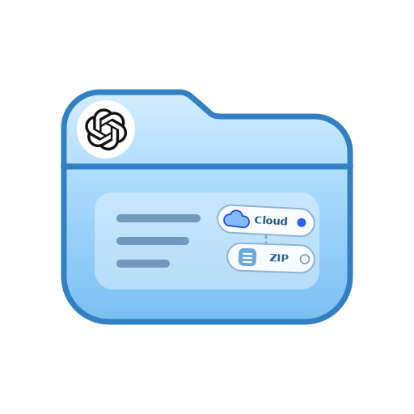

<p>
  <a href="https://github.com/0-V-linuxdo/ChatGPT-Universal-Exporter-Plus/raw/refs/heads/dev/ChatGPT%20Universal%20Exporter%20Plus.user.js">
    
  </a>
  
  &nbsp;&nbsp;
  <picture>
    <source media="(prefers-color-scheme: dark)" srcset="icon/title-dark.svg">
    <source media="(prefers-color-scheme: light)" srcset="icon/title-light.svg">
    
  </picture>
</p>

ChatGPT 网页导出脚本：本地 ZIP 或 Google Drive。支持个人/团队空间、归档聊天、Projects、自选对话和自动增量同步。

## 功能

| 项目 | 说明 |
| --- | --- |
| 范围 | Root Active、Root Archived、Projects。 |
| 方式 | 导出全部，或搜索后勾选部分对话。 |
| 本地 | 生成 ZIP，内含格式化 JSON。 |
| Drive | 逐条上传 JSON，按对话 ID 更新。 |
| Auto Sync | 页面打开时定时增量同步到 Drive。 |
| Workspace | 自动识别团队 Workspace；失败时可手动输入。 |

## 安装

1. 安装 Tampermonkey 或 Violentmonkey。
2. 打开 `ChatGPT Universal Exporter Plus.user.js`。
3. 点击 `Raw` 安装。
4. 刷新 `chatgpt.com` 或 `chat.openai.com`。

## 使用

| 操作 | 路径 |
| --- | --- |
| 手动导出 | 点击右下角 `📥` → 选择保存目标 → 选择空间 → 导出全部或自选对话。 |
| 自动同步 | 点击 `Auto Sync` → 新建任务 → 设置空间、间隔和 Root 范围。 |
| Drive 设置 | 备份设置 → 填写 Client ID、Client Secret、Refresh Token。 |

## 输出

| 目标 | 结果 |
| --- | --- |
| 本地 ZIP | Root 对话在根目录；Project 对话在项目文件夹。 |
| 单条 JSON | `标题｜YYYY-MM-DD HH-MM-SS.json` |
| Drive 手动导出 | `ChatGPT Universal Exporter Plus/Personal` 或 `.../<workspaceId>` |
| Drive 自动同步 | `ChatGPT Universal Exporter Plus/Account_<email>/Personal` 或 `.../Team_<workspaceId>` |

## 同步规则

| 项目 | 说明 |
| --- | --- |
| Drive 格式 | 上传 JSON，不上传 ZIP。 |
| 去重 | 使用对话 ID；已存在则更新。 |
| 重复文件 | 保留较新文件，并尝试清理重复项。 |
| 间隔 | 默认 15 分钟，最短 5 分钟。 |
| 运行条件 | Auto Sync 只在页面打开、脚本可运行时执行。 |

## 注意

- 必须保持 ChatGPT 登录。
- 导出量大时请保持页面打开。
- 脚本依赖 ChatGPT 网页内部接口；接口变更可能导致失效。
- Drive 凭据、任务和增量记录保存在用户脚本存储中。
- 本脚本不是 OpenAI 官方工具。

## 开发

```bash
npm install
npm run build
npm run check
```

| 路径 | 说明 |
| --- | --- |
| `src/app.js` | 主逻辑。 |
| `src/config/` | 用户脚本头、常量、图标。 |
| `src/core/` | 存储、DOM ready、JSZip 适配。 |
| `src/export/` | ZIP 生成。 |
| `src/ui/` | 样式。 |
| `scripts/` | 构建与检查。 |

## 致谢

基于 `ChatGPT Universal Exporter`（Me Alexrcer）二次开发。
